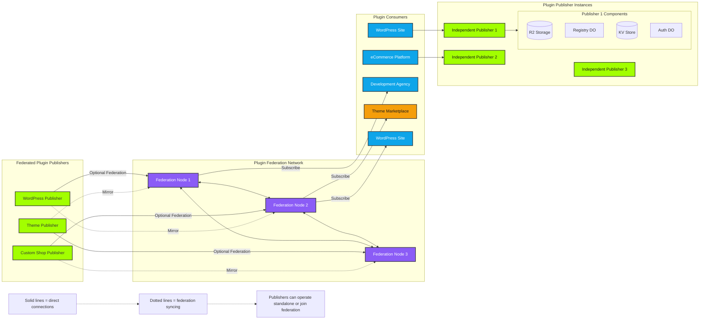

#Scratch Pad For Dreaming...

```mermaid
graph LR
    classDef federation fill:#8b5cf6,color:white,stroke:#333,stroke-width:2px
    classDef publisher fill:#a2ff00,color:#white,stroke:#333,stroke-width:2px
    classDef consumer fill:#0ea5e9,color:white,stroke:#333,stroke-width:2px
    classDef marketplace fill:#f59e0b,color:#191919,stroke:#333,stroke-width:2px
    classDef standalone fill:#a2ff00,color:#191919,stroke:#333,stroke-width:2px

    subgraph Federation["Plugin Federation Network"]
        FN1[Federation Node 1]:::federation
        FN2[Federation Node 2]:::federation
        FN3[Federation Node 3]:::federation
        
        FN1 <--> FN2
        FN2 <--> FN3
        FN1 <--> FN3
    end

    subgraph Federated["Federated Plugin Publishers"]
        PP1[WordPress Publisher]:::publisher
        PP2[Custom Shop Publisher]:::publisher
        PP3[Theme Publisher]:::publisher
    end

    subgraph Standalone["Plugin Publisher Instances"]
        SP1[Independent Publisher 1]:::standalone
        SP2[Independent Publisher 2]:::standalone
        SP3[Independent Publisher 3]:::standalone

        subgraph SP1_Components["Publisher 1 Components"]
            SP1_R2[(R2 Storage)]
            SP1_DO[Registry DO]
            SP1_KV[(KV Store)]
            SP1_AUTH[Auth DO]
        end
    end

    subgraph Consumers["Plugin Consumers"]
        C1[WordPress Site]:::consumer
        C2[eCommerce Platform]:::consumer
        C3[Development Agency]:::consumer
        C4[Theme Marketplace]:::marketplace
		C5[WordPress Site]:::consumer
    end

    %% Standalone connections
    SP1 --> SP1_Components
    C1 --> SP1
    C2 --> SP2
    
    %% Federation connections
    PP1 -->|"Optional Federation"| FN1
    PP2 -->|"Optional Federation"| FN2
    PP3 -->|"Optional Federation"| FN3
    
    %% Federation consumer connections
    FN1 -->|"Subscribe"| C3
    FN2 -->|"Subscribe"| C4
    FN2 -->|"Subscribe"| C5
    
    %% Cross-node syncing
    PP1 -.->|"Mirror"| FN2
    PP2 -.->|"Mirror"| FN3
    PP3 -.->|"Mirror"| FN1

    %% Add explanatory notes
    note1[Solid lines = direct connections]
    note2[Dotted lines = federation syncing]
    note3[Publishers can operate standalone or join federation]
    note1 -.-> note2
    note2 -.-> note3
```