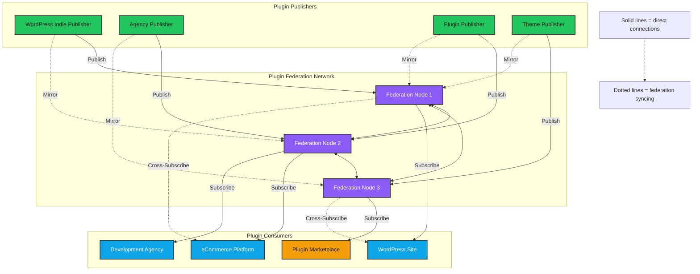

#Scratch Pad For Dreaming...

```mermaid
graph TD
    classDef federation fill:#8b5cf6,color:white,stroke:#333,stroke-width:2px
    classDef publisher fill:#22c55e,color:#191919,stroke:#333,stroke-width:2px
    classDef consumer fill:#0ea5e9,color:white,stroke:#333,stroke-width:2px
    classDef marketplace fill:#f59e0b,color:#191919,stroke:#333,stroke-width:2px

    subgraph Network["Plugin Federation Network"]
        FN1[Federation Node 1]:::federation
        FN2[Federation Node 2]:::federation
        FN3[Federation Node 3]:::federation
        
        FN1 <--> FN2
        FN2 <--> FN3
        FN1 <--> FN3
    end

    subgraph Publishers["Plugin Publishers"]
        PP1[WordPress Indie Publisher]:::publisher
        PP2[Agency Publisher]:::publisher
        PP3[Plugin Publisher]:::publisher
        PP4[Theme Publisher]:::publisher
    end

    subgraph Consumers["Plugin Consumers"]
        C1[WordPress Site]:::consumer
        C2[eCommerce Platform]:::consumer
        C3[Development Agency]:::consumer
        C4[Plugin Marketplace]:::marketplace
    end

    %% Publisher connections
    PP1 -->|Publish| FN1
    PP2 -->|Publish| FN2
    PP3 -->|Publish| FN2
    PP4 -->|Publish| FN3

    %% Consumer connections
    FN1 -->|Subscribe| C1
    FN2 -->|Subscribe| C2
    FN2 -->|Subscribe| C3
    FN3 -->|Subscribe| C4

    %% Cross-node syncing
    PP1 -.->|Mirror| FN2
    PP2 -.->|Mirror| FN3
    PP3 -.->|Mirror| FN1
    PP4 -.->|Mirror| FN1

    %% Consumer cross-subscription
    FN3 -.->|Cross-Subscribe| C1
    FN1 -.->|Cross-Subscribe| C2

    %% Add explanatory notes
    note1[Solid lines = direct connections]
    note2[Dotted lines = federation syncing]
    note1 -.-> note2
```