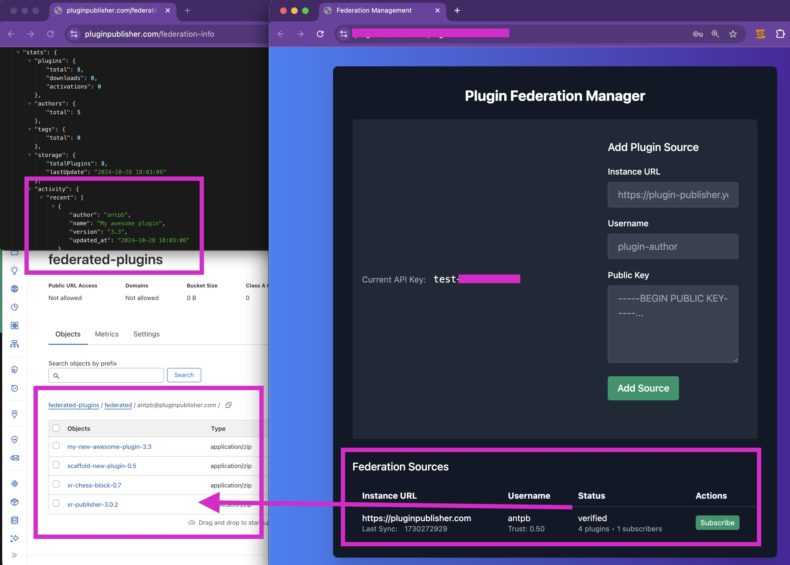
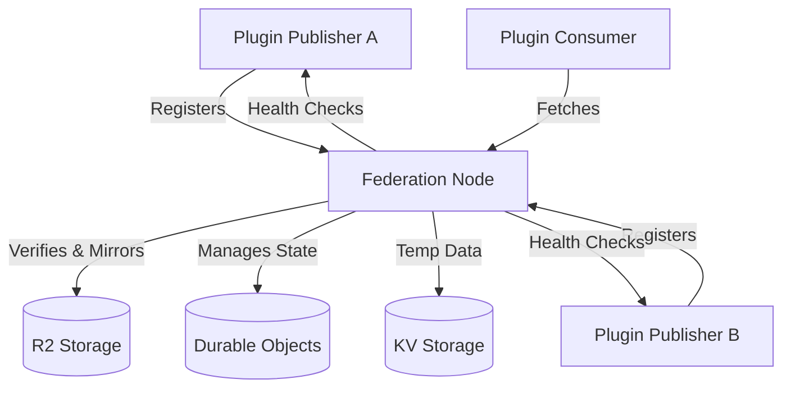
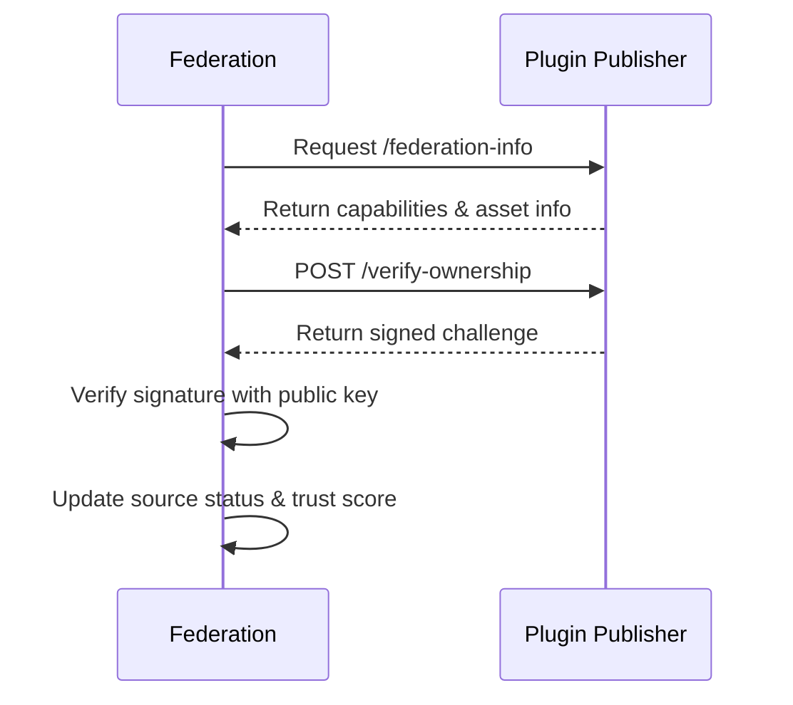
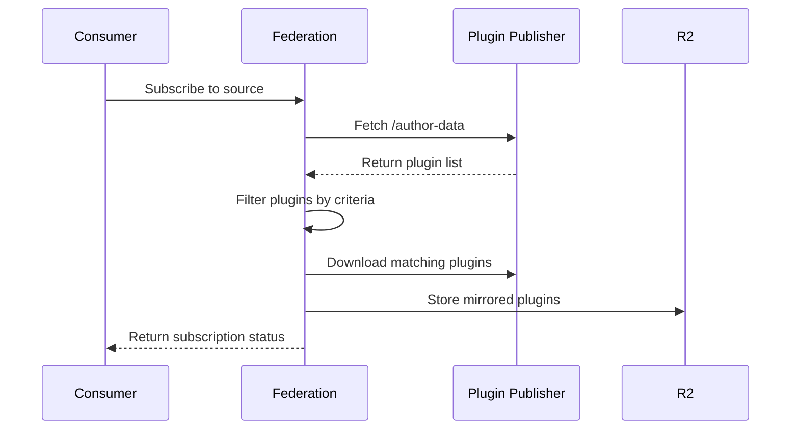

# Plugin Federation Network (PFN) - ⚠️ EXTREMELY FIRST DRAFT NOT PRODUCTION READY ⚠️

A decentralized plugin distribution network that connects independent plugin publishers into a federated ecosystem.



## Overview

Again caution, i wrote these docs in a much earlier state so some stuff may be off and using hacky workarounds to get a proof of concept running. Do not use this in production yet. I'm going to bed...zzzzzz

The Plugin Federation Network (PFN) is a decentralized system that enables independent plugin publishers to form a network of trusted sources, share plugins, and maintain a distributed plugin ecosystem. Built on Cloudflare Workers and Durable Objects, PFN provides:

- Decentralized plugin distribution
- Source verification and trust scoring
- Plugin mirroring and caching
- Cryptographic verification of plugin authenticity
- Selective subscription and filtering
- Health monitoring and synchronization

## Prerequisites

Before setting up a federation node, ensure you have:

- A Cloudflare account with Workers and R2 enabled
- An existing Plugin Publisher instance ([See Plugin Publisher documentation](../README.md))
- [Wrangler CLI](https://developers.cloudflare.com/workers/wrangler/get-started/) installed
- Node.js 18 or later

## Quick Start

1. Create a new federation node:
   ```bash
   # Clone the repository
   git clone https://github.com/xpportal/plugin-federation-network
   cd plugin-federation

   # Install dependencies
   npm install

   # Deploy the worker
   npx wrangler deploy
   ```

2. Generate Ed25519 signing keys:
   ```bash
   node -e "
   const crypto = require('crypto');
   const { privateKey, publicKey } = crypto.generateKeyPairSync('ed25519');
   console.log('Private:', privateKey.export({type: 'pkcs8', format: 'pem'}));
   console.log('Public:', publicKey.export({type: 'spki', format: 'pem'}));
   "
   ```

3. Add the keys to your worker:
   ```bash
   wrangler secret put FEDERATION_PRIVATE_KEY
   wrangler secret put FEDERATION_PUBLIC_KEY
   ```

## Architecture

The federation network consists of several components:

1. **Federation Node**: A Cloudflare Worker that manages plugin sources and distribution
2. **Federation Durable Object**: Maintains source registry and handles synchronization
3. **R2 Storage**: Stores mirrored plugin files
4. **KV Storage**: Manages temporary state



## Source Management

### Adding a Source

Sources are added via the federation admin interface or API:

```bash
curl -X POST https://your-federation.workers.dev/federation/add-source \
  -H "Authorization: Bearer YOUR_ADMIN_KEY" \
  -H "Content-Type: application/json" \
  -d '{
    "instance_url": "https://plugins.example.com",
    "username": "plugin-author",
    "public_key": "-----BEGIN PUBLIC KEY-----\n..."
  }'
```

### Source Verification Process



### Trust Scoring

Sources are assigned trust scores based on:

- Successful verifications
- Uptime and response time
- Plugin signature validity
- Federation age
- Number of subscribers

## Plugin Mirroring

### Mirroring Process

1. Source plugins are discovered via the `/author-data` endpoint
2. Plugin files are downloaded using the source's asset naming scheme
3. Files are verified against provided signatures
4. Verified plugins are stored in R2 with metadata

### Asset Naming Scheme

Sources must provide their asset information via the `/federation-info` endpoint:

```json
{
  "assetInfo": {
    "domain": "https://assets.example.com",
    "namingScheme": "plugins/author/slug/slug.zip"
  }
}
```

## Subscription Management

### Subscribing to Sources

```bash
curl -X POST https://your-federation.workers.dev/federation/subscribe \
  -H "Authorization: Bearer YOUR_API_KEY" \
  -H "Content-Type: application/json" \
  -d '{
    "sourceId": "author@plugins.example.com",
    "filters": {
      "tags": ["utilities", "productivity"]
    }
  }'
```

### Sync Process



## Database Schema

### Sources Table
```sql
CREATE TABLE sources (
  id TEXT PRIMARY KEY,              
  instance_url TEXT NOT NULL,
  username TEXT NOT NULL,
  public_key TEXT NOT NULL,
  status TEXT DEFAULT 'pending',    
  trust_score FLOAT DEFAULT 0.0,
  created_at INTEGER DEFAULT (unixepoch()),
  last_sync INTEGER,
  asset_domain TEXT,                
  asset_naming_scheme TEXT,         
  UNIQUE(instance_url, username)
);
```

### Subscriptions Table
```sql
CREATE TABLE subscriptions (
  id INTEGER PRIMARY KEY AUTOINCREMENT,
  source_id TEXT NOT NULL,
  subscriber TEXT NOT NULL,         
  filters TEXT,                     
  created_at INTEGER DEFAULT (unixepoch()),
  FOREIGN KEY(source_id) REFERENCES sources(id),
  UNIQUE(source_id, subscriber)
);
```

### Mirrored Plugins Table
```sql
CREATE TABLE mirrored_plugins (
  id INTEGER PRIMARY KEY AUTOINCREMENT,
  plugin_id TEXT NOT NULL,
  source_id TEXT NOT NULL,
  name TEXT NOT NULL,
  version TEXT NOT NULL,
  description TEXT,
  local_path TEXT NOT NULL,
  signature TEXT NOT NULL,
  mirror_date INTEGER DEFAULT (unixepoch()),
  FOREIGN KEY(source_id) REFERENCES sources(id),
  UNIQUE(plugin_id, source_id, version)
);
```

## API Endpoints

### Administrative Endpoints
- `POST /federation/create-admin-key`: Generate new admin API key
- `POST /federation/add-source`: Register new plugin source
- `GET /federation/sources`: List all registered sources
- `POST /federation/verify-source`: Manually trigger source verification

### Source Management
- `POST /federation/update-source`: Update source information
- `POST /federation/subscribe`: Subscribe to a source
- `GET /federation/source-status`: Get source health and sync status

### Plugin Access
- `GET /federation/plugins`: List available plugins
- `GET /federation/download`: Download mirrored plugin
- `GET /federation/verify`: Verify plugin signature

## Security Considerations

### API Key Management
- Admin keys prefixed with `fadmin_`
- Keys stored in KV with metadata
- Regular key rotation recommended
- Rate limiting on key creation

### Source Verification
- Ed25519 signature verification
- Challenge-response ownership proof
- Regular health checks
- Trust score adjustment based on reliability

### Plugin Integrity
- Original signatures preserved
- Additional federation layer signing
- Verification against source public key
- Immutable version storage

## Best Practices

1. **Source Management**
   - Regularly verify source health
   - Monitor trust scores
   - Clean up inactive sources
   - Update asset schemes when needed

2. **Plugin Mirroring**
   - Set appropriate storage quotas
   - Monitor storage usage
   - Implement cleanup policies
   - Verify all signatures

3. **Network Health**
   - Monitor node performance
   - Track synchronization status
   - Maintain backup nodes
   - Regular security audits

## Configuration

The `wrangler.toml` configuration for a federation node:

```toml
name = "plugin-federation"
main = "src/index.js"
compatibility_date = "2024-10-22"
compatibility_flags = ["nodejs_compat"]

[[durable_objects.bindings]]
name = "FEDERATION"
class_name = "FederationDO"

[[migrations]]
tag = "v3"
new_sqlite_classes = ["FederationDO"]

[[r2_buckets]]
binding = "PLUGIN_BUCKET"
bucket_name = "federated-plugins"

[[kv_namespaces]]
binding = "FEDERATION_KV"
id = "your-kv-namespace-id"
```

## Monitoring and Maintenance

### Health Metrics
- Source response times
- Sync success rates
- Storage usage
- API key usage
- Error rates

### Regular Tasks
- Source verification
- Trust score updates
- Storage cleanup
- Key rotation
- Schema migrations

## Troubleshooting

### Common Issues

1. **Source Verification Fails**
   - Check source URL accessibility
   - Verify public key format
   - Confirm federation-info endpoint
   - Check signature algorithm

2. **Plugin Mirroring Issues**
   - Verify asset naming scheme
   - Check storage permissions
   - Confirm signature validity
   - Monitor storage quotas
   - Check that scheduler is running in nodes.

3. **Subscription Problems**
   - Check source status
   - Verify filter syntax
   - Monitor sync logs
   - Check consumer permissions

## Contributing

Contributions are welcome soon...let me just vibe with this for a bit.